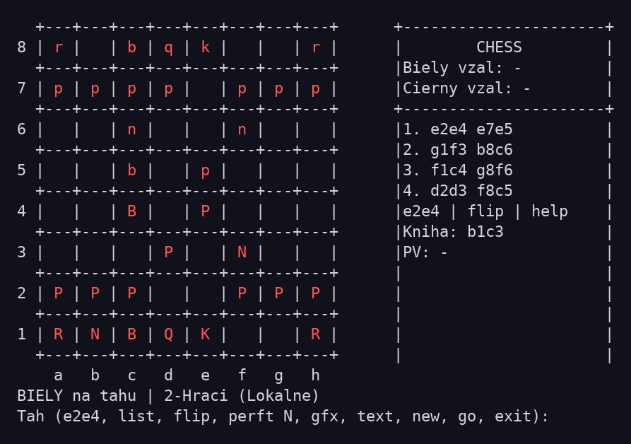
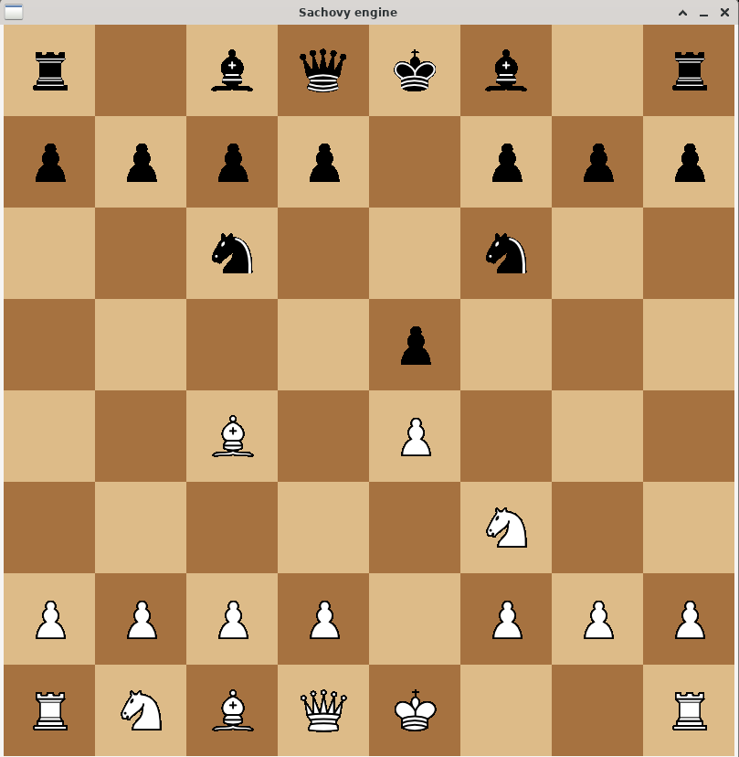

# Šachový engine (x86-64 Linux, NASM)

A high-performance chess engine written in x86-64 NASM assembly for Linux, featuring UCI protocol support, alpha-beta pruning with quiescence search, opening book integration, and both text and graphical (framebuffer/SDL) interfaces.

Textový šachový engine písaný v čistom NASM assembly pre x86-64 Linux.
Aktuálny stav: E4 alpha-beta + eval hotové, E5 opening book, E6 čiastočne (Syzygy `.rtbw` mmap loader + základný WDL probe), bočný panel v textovom móde a E7 grafika (framebuffer/SDL).

## Screenshoty

Textový mód s bočným panelom (história ťahov, zajaté figúrky, knižné ťahy):



Grafický SDL mód:



## Etapy

- **E0** ✅ Kostra: šachovnica, ASCII výpis, vstup `e2e4`, výmena strán
- **E1** ✅ Generátor pseudo-legálnych ťahov
- **E2** ✅ Legálne ťahy + šach/mat/pat detekcia, 50-ťahové pravidlo, 3x opakovanie pozície
- **E3** ✅ NegaMax (hĺbka 3-4), engine hrá čierneho
- **E4** ✅ Alpha-Beta + evaluácia (materiál + PST), quiescence
- **E5** ✅ Opening book (vlastný formát `hash | move`)
- **E6** 🚧 Syzygy/Nalimov čiastočne: `SyzygyPath`/`SyzygyProbeDepth`, mmap loader pre `.rtbw`, `tbtest`, WDL/DTZ bootstrap + guardrails, oracle helper pre cross-check
- **E7** ✅ Grafika: framebuffer/SDL, BMP figúrky, klikacie rozhranie
- **E8** ✅ Textový UI panel: história ťahov, zajaté figúrky, knižné ťahy, UCI

## Kompilácia

```bash
./build.sh
```

alebo manuálne (odporúčam `make`, ktoré to spraví za teba):

```bash
make
```

Binárka `./chess` obsahuje všetky backendy naraz (text, framebuffer aj SDL),
SDL (`libSDL2`) sa linkuje dynamicky.

Na NixOS, ak nemáš `nasm` v PATH, `./build.sh` ho automaticky získa cez `nix-shell`.

## Spustenie

```bash
./chess
```

Zadávaj ťahy v algebraickej notácii, napríklad `e2e4`, `g1f3`.
Príkaz `flip` prepne orientáciu výpisu šachovnice.
Príkaz `new` spustí novú hru, `go` nechá engine zahrať jeden ťah za aktuálnu stranu.
Príkaz `gfx` prepne do grafického režimu (framebuffer `/dev/fb0` alebo SDL okno,
podľa `chess.ini` a dostupnosti), `text` vráti späť do terminálu.
Príkaz `uci` prepne do UCI režimu pre pripojenie k GUI.
Ukonči program príkazom `exit` alebo `quit`.

V `chess.ini` môžeš nastaviť aj `syzygy=` na cestu k TB tabuľkám (prázdne = vypnuté).

V textovom móde sa vpravo od šachovnice zobrazuje panel s históriou ťahov,
zajatými figúrkami a knižnými ťahmi pre aktuálnu pozíciu (ak sú v `book.book`).

## Reprezentácia

- `board[64]` – index `0 = a1`, `63 = h8`
- Figúra na políčku: bity `0-2` typ, bit `3` farba
- Ťah: 16-bitové číslo `from(6) | to(6) | flags(4)`

Poznámka: interné testovacie a debug workflow sú presunuté do lokálnej internej dokumentácie mimo verejný repozitár.

---

Copyright (c) 2026 Marek Suchý <marek.suchy@gmail.com>. Všetky práva vyhradené.
